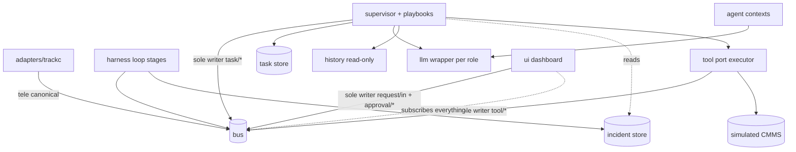
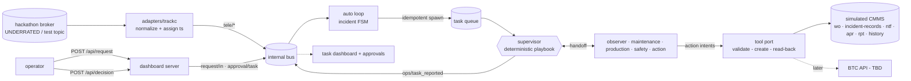

# Architecture Spine — Track C Multi-Agent Factory Coordination

## Design Paradigm

**Orchestrator–workers with deterministic playbooks** on the existing publish/subscribe spine. A single persisted **task queue** is the unit of coordination; a deterministic **supervisor** walks each task through a **playbook** (task type → fixed sequence of agent stages, with declared back-edges); each **agent** is an independent LLM conversation that fills a stage's content, never chooses the next stage. Every handoff, tool call, approval, and verification is a versioned event on the bus — the audit trace *is* the bus traffic. Two doors feed the one queue: operator requests and the existing telemetry-driven auto loop (hybrid mode).

| Layer | Namespace | Owns |
| --- | --- | --- |
| ingress (external) | `adapters/trackc.py` | the only connection to the hackathon broker; payload normalization + event-`ts` assignment — nothing else |
| coordination | `orchestration/` | task store, supervisor (playbook router), agent roles |
| actions | `tools/` | Tool port (validation, idempotency registry, read-back) + simulated CMMS |
| observation | existing harness loop | detection episodes → incidents; may spawn tasks; otherwise untouched |
| presentation | `ui/` | task-centric dashboard, agent trace, approval inbox; HTTP ingress endpoints — subscribe-only otherwise |

## Inherited Invariants

Parent: `architecture-seal-iot-2026-08-15/ARCHITECTURE-SPINE.md`. Binding, read-only, original IDs.

| Inherited | From parent | Binds here |
| --- | --- | --- |
| AD-1 — LLM never commands | parent AD-1 | agents propose intents only; the Tool port runs deterministic pre-execution validation (registry/state/schema/idempotency checks) before any write — a shield in the parent's spirit, never bypassable; if a future BTC API reaches physical equipment, the parent `SafetyShield` applies on top |
| AD-2 — persistent resumable FSM | parent AD-2 | the task store copies the incident-store discipline (SQLite WAL, sole writer, transition table, resume on start, TTL escalation, retry caps) |
| AD-7 — one transport contract | parent AD-7 | internal bus stays mosquitto behind pluggable transports; record/replay first-class — with replay pinned as a **render, never an execution** (AD-13) |
| AD-8 — dataset knowledge quarantined in the adapter | parent AD-8 | the Track C stream's device registry, signal mapping, units, and topology live in `mapping.yaml` (`trackc:` section) + `adapters/` — never in `harness.yaml` or pipeline code |
| AD-9 — every action verified | parent AD-9 | work-order creation is create-then-read-back; no silent completion |
| AD-10 — one logical clock, event time | parent AD-10 | freshness computed from event `ts`; one admitted wall-clock exception (AD-8 approval timeout) |
| AD-11 — one history, one metric writer | parent AD-11 | agents read `history/`; orchestration never writes telemetry or metrics |
| AD-13 — degraded modes rehearsed | parent AD-13 | tool-timeout / stale-data / LLM-outage behavior (brief scenario 3) are built, rehearsed modes with visible state |
| AD-14 — demo observability | parent AD-14 | audit trace, per-stage latency, subscribe-only zero-build UI |

Parent AD-3/4/5/6/12 govern the auto loop's internals (runbooks, detection, RCA, objective function, plant model) and are **not inherited as constraints on this layer** — orchestration consumes their outputs as library calls/events. `knowledge/runbooks` is additionally bound as a declared input of the `maintenance` role (Conventions).

## Invariants & Rules

### AD-1 — One queue, one supervisor; spawn is idempotent; the request path stands alone

- **Binds:** orchestration, ui, harness loop interface
- **Prevents:** two coordinators (the auto loop and the request path) independently dispatching agents against the same devices; an escalation loop minting duplicate tasks — and each duplicate legitimately minting a duplicate work order through AD-6's task-scoped key; the judged request path failing because the auto loop is down.
- **Rule:** Exactly two doors create tasks — `request/in` (operator text, published by the dashboard HTTP server) and the auto loop's spawn hook (incident → task) — both minting into **one persisted queue owned by `orchestration/task_store.py`**. Exactly one supervisor instance consumes the queue, routes playbooks, and publishes `task/*`. The auto loop never calls an agent directly. **Spawn discipline:** at most one live task per `(incident_id, playbook_id)`, enforced by a unique index; a re-spawn of a live pair may only raise its priority, never mint. Incident severity → task priority is a **mandatory config table** validated against the closed set {SAFETY, URGENT, ROUTINE} — never silently defaulted. The request-driven path has no dependency on the auto loop being healthy. [ADOPTED]

### AD-2 — Task sits above incident; task state is a persisted resumable FSM

- **Binds:** orchestration, incident
- **Prevents:** overloading the incident FSM with coordination state (two lifecycle vocabularies fighting in one table); lost coordination work on restart — which also kills retry idempotency (AD-6).
- **Rule:** An **incident** remains a device fact owned by `incident/` (states `DETECTED…ESCALATED`, unchanged). A **task** is the unit of coordination owned by the task store; it *references* incidents (`source_incident_id`, nullable for operator-initiated tasks) and never mutates them. Task states: `RECEIVED → PLANNING → COORDINATING → AWAITING_APPROVAL → EXECUTING → VERIFYING → REPORTED`, with `AWAITING_CLARIFICATION`, `PREEMPTED` (resumable, AD-7) and terminal `PARTIAL`, `FAILED`, `CANCELLED`, `REPORTED` — `PARTIAL`/`FAILED` must name the failed step. SQLite WAL, single writer, validated transition table, resume at last valid state on startup, wall-clock TTL escalation for `AWAITING_APPROVAL`/`AWAITING_CLARIFICATION`, bounded re-plan attempts (AD-3). The `IncidentStore` discipline, copied. [ADOPTED]

### AD-3 — Deterministic playbook routing; LLM fills content, never next-hop; re-plan is a declared back-edge

- **Binds:** orchestration, agents
- **Prevents:** an LLM hallucinating a handoff (calling an agent that doesn't exist, skipping verification, jumping to execution) — unreproducible exactly when judges are watching; graceful-failure-without-re-planning, which scenario 3 explicitly watches for.
- **Rule:** A **playbook** maps task type → fixed sequence of stages from a **closed stage menu** (`observe | analyze | adjudicate | plan | act | verify | report`), each stage bound to one agent role, declaring: priority, device set (per stage), approval marks, inputs, and **back-edges** (which earlier stage a failed stage may re-enter, with an attempt cap). The supervisor executes the sequence; agents return structured JSON for their stage only. **Re-plan** = a back-edge taken with the failure event in context, published as `task/<id>/replan`; beyond the cap → `PARTIAL`/`FAILED`. Requests matching no playbook fall to the **generic guarded playbook**: the supervisor LLM composes a plan *from the closed stage menu only*; anything outside the menu is rejected by code; clarify-and-ask (task → `AWAITING_CLARIFICATION`, reply rides `request/in` with `in_reply_to`) only when device or task type cannot be extracted. Conflict handling (brief scenario 2) runs a fixed `adjudicate` stage: the LLM produces the trade-off options, a human picks (AD-8), code records. [ADOPTED]

### AD-4 — Agents are contexts, not processes; each role degrades rehearsed

- **Binds:** orchestration
- **Prevents:** spending the hackathon debugging IPC instead of the product; mistaking process count for multi-agent-ness; one starved LLM budget silently degrading every agent at once.
- **Rule:** One process. Each agent role (`supervisor`, `observer`, `maintenance`, `production`, `safety`, `action`) is an object with its **own LLM conversation** and its **own `LLMClient` instance** (per-role budget declared in config, so roles cannot starve each other; exhaustion triggers that role's fallback and is visible on the UI). Every role must carry a responsibility no other role covers — the brief's minimum is 3 agents, at least one task needing 2+. Each role has a **rehearsed degraded mode** (inherited AD-13): observer → deterministic summary from `history/`; maintenance → template plan; supervisor → canned playbooks; no agent fabricates content its inputs don't support. No OS processes, no agent-to-agent direct calls — the supervisor is the agents' only I/O. [ADOPTED]

### AD-5 — Coordination is bus traffic; one publisher per topic family; replay is render-only

- **Binds:** orchestration, tools, ui
- **Prevents:** audit trace becoming bespoke logging each agent invents; dual writers racing on task topics; browser-to-broker requiring mqtt.js/WebSockets (breaking zero-build); replay double-mutating live state.
- **Rule:** Every coordination step is a schema-versioned envelope on the bus. **Topic-family ownership:** `task/<task_id>/…` (opened, handoff, replan, state, approval_requested/granted/denied, closed) — sole publisher: **supervisor**. `tool/<tool>/…` (invoked, result, verified, failed) — sole publisher: **Tool port**. `request/in` and `approval/<task_id>` — sole publisher: **the dashboard HTTP server** (the only inbound surface; it holds the bus connection, so the browser needs no MQTT client — zero-build preserved). The supervisor is the sole consumer of `request/in` and `approval/*`; nothing else may write another family. Operator text and approval decisions are therefore themselves bus traffic (auditable, recordable). All of it lands in the JSONL recorder; replay follows AD-13. [ADOPTED]

### AD-6 — All writes go through the Tool port: validate → create → read-back, idempotent across backends

- **Binds:** tools, orchestration, agents
- **Prevents:** fabricated success (the brief's explicit scoring trap); duplicate work orders on retry; a future BTC API swap rewriting agent code — or silently losing the dedupe registry.
- **Rule:** Agents never write; they emit structured **action intents**. Only `tools/port.py` executes, in three steps: **deterministic pre-execution validation** (intent schema; `device_id` in the registry; task in a state allowed to act; priority class valid; idempotency-key well-formed) — the shield-equivalent gate, never bypassable; then **create** against a backend; then **read-back verification** (fetch the created object; check device, content — including its evidence block — and status) before any stage may claim success. Catalog: work orders, incident records (AD-12), notifications, **approval requests** (an acceptance-list artifact: create → `apr_` record `PENDING`, status updates read-back verified), reports, plus read-only lookups (maintenance history, production context) — all in the **simulated CMMS** now, the BTC API later behind the same interface. The **idempotency key registry is port-owned state** (`task_id + action_type + device_id` → backend object id), so a backend swap keeps its dedupe memory; backends contract only create/read/list. On timeout or ambiguous failure: **list by key before retrying** — an existing match is reused and reported, never duplicated. Unresolvable states surface as `PARTIAL`/`FAILED` with the exact step. [ADOPTED]

### AD-7 — Priority preemption with device-scoped locks derived from task state

- **Binds:** orchestration
- **Prevents:** a routine inspection holding a gas-alarm task hostage — or a safety task freezing the whole floor; a crashed task keeping its locks forever; the auto loop actuating a device a task is working on.
- **Rule:** Priority classes `SAFETY > URGENT > ROUTINE`, from the playbook (or the mandatory spawn table, AD-1); the LLM may propose, code validates against the closed set. **Each playbook stage declares its device set** (registry `device_id`s, AD-11); a task's held set = union over incomplete stages — locks are **derived state recomputed from the task store**, never a side table. A higher-class task preempts by taking over contended devices: stages whose device set intersects the contended devices freeze (task → `PREEMPTED`); other-device stages continue; locks are auto-released on any terminal transition and re-derived on resume, with a wall-clock TTL backstop matching the approval timeout. Devices locked by an active task are flagged maintenance-state, which the parent `SafetyShield` already blocks auto-loop candidates on — the two remediation planes cannot collide. Arbitration is deterministic code; the LLM presents the conflict and options (AD-3), never decides them. [ADOPTED]

### AD-8 — Approval is a Tool-created artifact and a task state; the gate is wall-clock bounded

- **Binds:** orchestration, tools, ui
- **Prevents:** "critical action" approvals living in UI state or chat logs — unauditable, unreplayable, bypassable; every routine work order parking for a click (demo friction the brief does not ask for); an approval wait without a clock wedging device locks forever.
- **Rule:** A playbook marks which steps are critical — default critical: safety-class tasks, conflict adjudication results, playbook-declared major changes; routine work orders and notifications/report steps may be marked non-critical. A critical step parks the task in `AWAITING_APPROVAL`, and the supervisor **creates an approval request via the Tool port** (`apr_` record, read-back verified, status `PENDING`) before publishing `approval_requested` with approval id, options, conflict, and evidence. The manager's decision enters via the dashboard (`approval/<task_id>` on the bus, AD-5); the supervisor validates it cites the pending `apr_` id for a task actually in `AWAITING_APPROVAL`, updates the record (`APPROVED`/`DENIED`, read-back verified), then transitions and publishes `approval_granted/denied`. Incident `human_approve` (parent FSM) and task approval are **distinct gates on distinct entities**. **Approval timeout is wall-clock** — the one admitted exception to event time (a human-wait, not a pipeline window; logged as such) — routing to `CANCELLED`/`PARTIAL` with a notification. [ADOPTED]

### AD-9 — The hackathon broker is quarantined behind one adapter

- **Binds:** adapters/trackc.py, config
- **Prevents:** broker credentials, payload schema, and topic drift leaking into pipeline code; a Day-1 swap (test key/topic → live key/topic) becoming a rewrite; two freshness verdicts disagreeing on the dashboard.
- **Rule:** `adapters/trackc.py` is the **only** component connected to the external broker: it subscribes, normalizes payloads to canonical `TelemetryEnvelope` (`tele/<signal_id>`), assigns event `ts` from the source payload (never wall clock), and republishes onto the internal bus — **nothing else**: no staleness computation (that is AD-10's, solely), `quality` stays ingest truth (bad reading/checksum — never age). Credentials come from gitignored `mqtt.env` (`username_pw_set`/`tls_set` applied here, in the adapter — `PahoTransport` stays credential-free); topics and the device registry from `mapping.yaml`'s `trackc:` section (source-specific knowledge belongs there per parent AD-8), which also declares **device relations** (adjacency for "related devices," scenario 1). `harness.yaml` `trackc:` holds only runtime knobs (staleness thresholds, budgets, TTLs). Subscribe by team prefix so the live-event topic swap is a config change. Assumption: username/password are CONNECT credentials; the `tk_…` key's purpose is open (Deferred). [ADOPTED]

### AD-10 — Freshness is a first-class finding, computed once, never a detection gate

- **Binds:** observer agent, orchestration
- **Prevents:** agents reasoning over stale telemetry as if current — the exact failure the brief's scenarios 2 and 3 test; adapter-vs-agent staleness verdicts diverging; staleness silently disabling detection.
- **Rule:** Staleness is computed **exactly once, by the observation path**: every observation the `observer` returns carries, per device, latest value, event-time age, and a staleness class from `harness.yaml` thresholds. Stale or missing data is stated in the finding and **shapes the plan** (flagged assumption, narrowed recommendation, or refusal to recommend) — never silently dropped, never filled with invented values. **Stale telemetry continues to feed PERCEIVE** — staleness is a finding, not a gate on detection. Tool non-response follows the same rule via AD-6's partial/failed states. [ADOPTED]

### AD-11 — Identity is owned: one device registry, one incident minter

- **Binds:** adapters, orchestration, tools, ui
- **Prevents:** `MOTOR_01` vs `motor_01` locks that never contend (concurrent execution on the same physical motor — the multi-brain failure re-entered through the back door); idempotency keys that dedupe or duplicate depending on spelling; two uncorrelatable ID namespaces for one real-world incident.
- **Rule:** **Devices:** the `trackc:` registry in `mapping.yaml` is the closed canonical set — `device_id` matches `^[a-z0-9_]+$`, each device declares its member `signal_id`s; aggregate devices (line/area) declare member devices. Locks, staleness reports, idempotency keys, and work-order fields **must** use registry `device_id`s — anything else is rejected by code (same treatment as the closed stage menu). Locking an aggregate acquires all members. **Incidents:** `incident/` remains the sole minter of incident identity **everywhere, including inside the CMMS** — the CMMS holds records *about* incidents keyed on the harness `incident_id` (`source_incident_id`) and mints only prefixed local ids (`wo_…`, `ntf_…`, `apr_…`, `rpt_…`, `mxt_…`); the brief's "create incident" tool-op creates such a referencing record, never a second incident identity. [ADOPTED]

### AD-12 — Two action planes, two verifiers, one completion bridge

- **Binds:** orchestration, tools, harness loop
- **Prevents:** a task `act` intent ever reaching `cmd/*` (two verifiers claiming one action with opposite success criteria); the demo frame "green task, red incident, forever" — nobody closing the incident its task just serviced.
- **Rule:** The task layer's actions are **informational only** (work orders, notifications, reports, approval records); actuator effects remain exclusively the harness loop's via the parent executor — a task `act` intent may **never** publish `cmd/*`. Correspondingly: task `verify` = CMMS read-back, only; incident VERIFY = telemetry outcome classification (`improved | no_change | worsened`), only. The only path from task completion back to incident state is an **event**: the supervisor publishes `ops/task_reported`, which the incident FSM consumes and validates as an input (treated as external-maintenance-complete → `VERIFYING`); orchestration never writes incident state. [ADOPTED]

### AD-13 — Replay is a render, never an execution

- **Binds:** orchestration, ui, harness loop, recorder
- **Prevents:** the rehearsed fallback itself violating sole-publisher (replayed `task/*` events double-transitioning a resumed task store); replay re-triggering the auto loop and minting live duplicates of recorded tasks; each rehearsal polluting the recording for the next one.
- **Rule:** In `mode: replay` (explicit flag): stores open **read-only**; the supervisor's publication, the spawn hook, and the Tool executor are **suppressed**; replayed events route to the UI only; the recorder writes to a **fresh file**, never appends to the source log. Replay never mints, never transitions, never publishes. Live mode is the only mode that mutates anything. [ADOPTED]

## Dependency direction



Rules the diagram encodes: orchestration reads `incident/` but never writes it; the loop never depends on orchestration (it only spawns tasks via the store); `ui/` depends on nothing but the bus; agents hold no bus handle and no store handle — the supervisor is their only I/O; the dashboard server is the sole ingress publisher.

## Consistency Conventions

| Concern | Convention |
| --- | --- |
| Topic families | existing `tele/`, `ops/`, `cmd/` unchanged; new `task/<task_id>/<event>`, `tool/<tool>/<event>`, `request/in`, `approval/<task_id>` — each family has exactly one publisher (AD-5) |
| Envelopes | new `TaskEvent`/`ToolEvent` dataclasses in `bus/` with `task_id`, `stage_name`, `agent`, `tool`, `priority` **top-level**; **per-family** `schema_version` (telemetry stays v1; task/tool start at v1 — no global bump); the task-stage field is `stage_name` from a closed enum disjoint from `ops/` stage names |
| IDs | `task_id` = `t-` + 8 hex, minted only by the task store; `incident_id` = 12 hex as-built (`incident/fsm.py`), minted only by `incident/`; CMMS local ids prefixed (`wo_`, `ntf_`, `apr_`, `rpt_`, `mxt_`); priority ∈ {SAFETY, URGENT, ROUTINE}; playbook ids stable snake_case |
| State mutation | task rows only via `orchestration/task_store.py`; work orders/records only via `tools/port.py`; incident state stays with `incident/`; telemetry with ingest; one writer per store, WAL + busy_timeout |
| Task lifecycle | `RECEIVED → PLANNING → COORDINATING → AWAITING_APPROVAL → EXECUTING → VERIFYING → REPORTED` + `AWAITING_CLARIFICATION`, `PREEMPTED`, terminal `PARTIAL/FAILED/CANCELLED`; transitions validated against one table; `PARTIAL`/`FAILED` name the failed step |
| Evidence block | every `plan`/`report` output and every work-order intent carries an evidence block (device, signal, value, event-time, age, staleness class) copied from the observer payload; read-back checks it is present |
| Reports | the `report` stage binds the `supervisor` role and must produce a manager-condensed summary (decision, options considered, evidence, owner, status) plus the full trace by link |
| Agent inputs | `maintenance` reads `knowledge/runbooks` + CMMS maintenance history; `production` reads the CMMS production-context table (orders/shift plan, seeded from `mapping.yaml: trackc:`); the no-fabrication rule (AD-10) applies to both |
| LLM access | one `LLMClient` per agent role + supervisor; role prompts, budgets, and fallback routing in config; all calls through `llm/`; LLM output always structured JSON |
| Config | `mapping.yaml` `trackc:` = source knowledge (device registry + relations, signal map, units, production-context seed); `harness.yaml` `trackc:` = runtime knobs (staleness thresholds, budgets, TTLs, severity→priority table); credentials only in gitignored `mqtt.env`; nothing hardcoded |
| Ingress | the dashboard HTTP server exposes `POST /api/request` and `POST /api/decision`, and is the only component that publishes `request/in` / `approval/<task_id>`; no WebSocket, no mqtt.js, no new dependencies |
| UI | task-centric layout: active task → agent trace → approvals → MQTT status; per-stage wall-clock latency visible; zero build step, demoable with UI killed (inherited AD-14) |
| Dates / language | ISO-8601 event time everywhere; wall-clock admitted only for logs, LLM budget, demo stopwatch, approval TTLs, lock backstop; UI + TTS Vietnamese; code/events/docs English |

## Stack

SEED — same stack as the parent spine; **no new dependencies by design**.

| Name | Version |
| --- | --- |
| Python | 3.12 (uv-managed; repo floor `>=3.11.9,<3.13`) |
| paho-mqtt | 2.1.0 — external-broker auth (`username_pw_set`, optional `tls_set`) applied in `adapters/trackc.py`; `PahoTransport` unchanged |
| Eclipse Mosquitto | 2.1.2 — internal bus; local install, not repo-pinned |
| Hackathon MQTT broker | host/port/TLS unknown until provided — absorbed entirely by AD-9 |
| SQLite | stdlib — task store + simulated CMMS, WAL |
| OpenRouter | via existing `llm/` wrapper (`httpx`), per-role model routing in config |

## Structural Seed

```text
{root}/
  orchestration/          # NEW — the coordination layer (AD-1..8, 12)
    task_store.py         #   sole writer of task state; mints t- ids; unique (incident, playbook) live index; resumes on start
    supervisor.py         #   playbook router; sole publisher of task/*; consumes request/in + approval/*
    playbooks.py          #   task-type → stages, priority, per-stage device sets, approval marks, back-edge caps
    agents/               #   LLM contexts, one LLMClient each: observer, maintenance, production, safety, action
  tools/                  # NEW — the action surface (AD-6, 11)
    port.py               #   validate → create → read-back; port-owned idempotency key registry; lookup ops
    cmms_sim.py           #   SQLite: work orders, incident records (FK), notifications, approval requests,
                          #   reports, maintenance history, production context (seeded)
  adapters/trackc.py      # NEW — sole egress to the hackathon broker (AD-9)
  ui/dashboard.py         # extended: POST /api/request, POST /api/decision (sole ingress publisher)
  ui/app.html             # extended: task panel, agent trace, approval inbox, MQTT status
  ... existing packages unchanged (bus, history, perceive, diagnose, decide, act,
      verify, learn, incident, knowledge, llm, plant_model, score)
```



## Capability → Architecture Map

Judged requirements from the Track C brief → where each lives and what governs it.

| Brief requirement | Lives in | Governed by |
| --- | --- | --- |
| Ingest ≥ 4/6 devices, MQTT status visible | `adapters/trackc.py`, `ui` | AD-9, AD-11, inherited AD-10 |
| ≥ 3 agents, ≥ 1 task using 2+ agents | `orchestration/agents/` | AD-3, AD-4 |
| A decision/plan informed by MQTT data | observer stage feeding adjudicate/plan | AD-3, AD-10 |
| Tool creating work order / incident record / notification / **approval request** / report | `tools/port.py` + CMMS | AD-6, AD-8, AD-11 |
| Verification + no duplicate on retry | validate → create → read-back + port-owned key registry + list-before-retry | AD-6, inherited AD-9 |
| Scenario 1 (prepare inspection, related devices) | playbook `prepare_inspection`: observe[+adjacent] → plan → analyze → adjudicate → act → verify → report | AD-3, AD-9 (relations) |
| Scenario 2 (production vs safety conflict, urgent order) | playbook `conflict_assessment`: observe → analyze×2 → adjudicate → act[approval-marked] → verify → report; production reads order context | AD-3, AD-7, AD-8 |
| Scenario 3 (tool timeout / stale data / re-plan) | AD-6 retry + AD-3 back-edges + AD-10 staleness + rehearsed degraded modes | AD-3, AD-6, AD-10, inherited AD-13 |
| Which IoT data influenced the plan; work orders carry context | evidence block on plans/reports/work orders | Conventions (Evidence) |
| Manager-condensed reporting | supervisor-authored `report` stage | Conventions (Reports) |
| Dashboard clear under concurrent updates | subscribe-only UI, task-first priority | inherited AD-14 |

## Deferred

- **BTC broker host/port/TLS + payload schema** — blocked on organizer input; probe script (`scripts/probe_mqtt.py`) ready. AD-9 exists so this lands as config + adapter internals only.
- **`tk_…` key purpose & the real BTC Tool/API** — the port (AD-6) with its port-owned key registry is the swap point; bind as a second backend, never a rewrite of agents.
- **Auto-spawn policy tuning** — *which* anomaly classes auto-open tasks (the *idempotency and priority mapping* are structural and decided, AD-1); tunable once the real stream's behavior is known.
- **LLM model routing per agent role** — config-time choice via the existing wrapper; not architectural.
- **Approval UX details & TTS for task events** — presentation polish on the UI convention; TTS clips extend `EVENT_CLIPS`.
- **Publishing outward to the hackathon broker** (if the platform expects commands/presence back) — same adapter, AD-9, decided when platform docs arrive.
- **Conscious overage, kept deliberately:** hybrid auto-spawn and AD-7 preemption are not brief requirements — they are the product's differentiation and the reason the single-queue defense exists. Accepted with eyes open; the judged request path never depends on them (AD-1).
